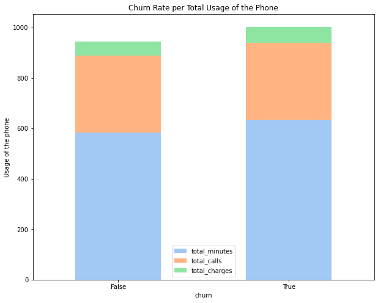

#  SyriaTel Customer Churn Prediction

**By**: Jinsol Cantrall
****
## ●Overview●
**SyriaTel** is expanding its business and wants to increase its customers. However, before expanding, SyriaTel wants to find out if the company could stop the customers who are canceling the subscription. With the datas that are given, is it possible to know the reason for the canceling the service and predict the churn rate(a measurement of the percentage of accounts that cancel). If so, can the company improve the service and stop customers from canceling?

## ●Business Problem●
▶ Currently, businesses want to know the churn rate. If the churn rate is high, business wants to improve on the reasons for the cancellation of the service. If the churn rate is not high, business wants to reward the loyal customers and increase its business.
 
 
① What is current churn rate? 
 
② What are the top 5 reasons that people are canceling?
 
③ What are the recommendations to improve the satisfaction?
 
④ Should the business focus on getting new customers?
 
⑤ Can the business predict customers who are staying and leaving?

## ●Data Understanding●
▶ **SyriaTel** dataset was obtained from https://www.kaggle.com/becksddf/churn-in-telecoms-dataset
 
▶ Dataset contained 21 columns and 3333 rows
 
 
## ●Results●

 
▶The **Random Forest Classifier model** is 96.85% accurate in classifying churn of the customer. It predicted correctly that 564 customers are staying and 83 customers are going to churn and predicted incorrectly that 2 customers are staying and 18 customers are leaving. 
 
 
▶Answering Questions:
 
 
① What is current churn rate? 
 
14.49% of customers are True for Churn
 
 
② What are the top 5 reasons that people are canceling?

 
Total Charges, Customer Service Calls, Total Day Minutes, Total Minutes, and Total Day Charge
 
 
③ What are the recommendations to improve the satisfaction?
 
Total Charge of the bill is one of the biggest reason that people are cancelling. Decrease charge or having an unlimited plan would help. Also customer service calls are important for customer to stay. Improve customer service call quality and find out the reason why customers are complaining and fix the issue.
 
 
④ Should the business focus on getting new customers?
 
14.49% churn rate is higher than I expented. 14 out of 100 customers are leaving. I would recommend satisfy the current customers first to reduce the churn rate.
 
 
⑤ Can the business predict customers who are staying and leaving?

Yes. My model predicted correctly that 564 customers are staying and 83 customers are going to churn and predicted incorrectly that 2 customers are staying and 18 customers are leaving. 
 
 

## ●Next Steps●
This dataset is too small to generallize everything. Improving the size of dataset would give the business better idea of the problems. Collect more information about the customers and see if churn rate could be improved.

